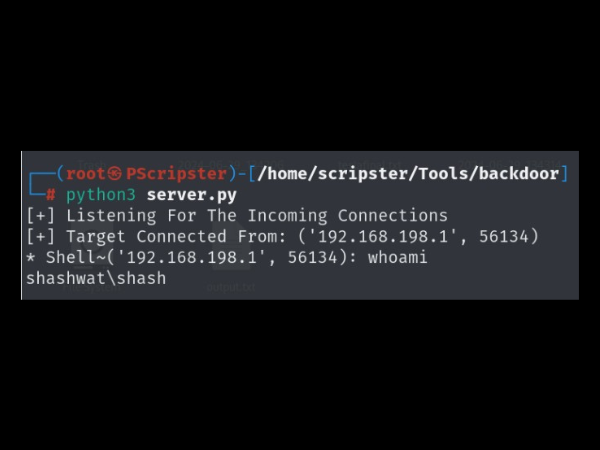
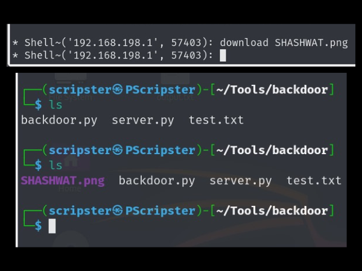
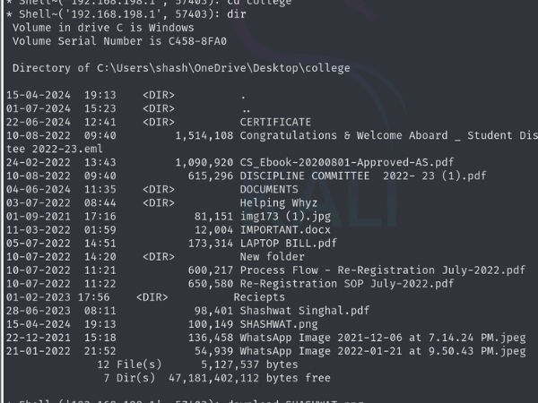

# Backdoor Project

This project is a simple backdoor program developed by Shashwat Singhal. It consists of a server (`server.py`) and a client backdoor (`backdoor.py`) that can be used to control a remote machine. The project demonstrates fundamental concepts of networking, file transfer, and remote shell execution in Python.

## Technologies Used
- Python
- Sockets
- JSON
- OS and Subprocess modules

## Project Description

The backdoor program consists of two main components:

1. **Server (`server.py`)**: This script runs on a Kali machine and listens for incoming connections from the target machine. It provides a command shell interface to interact with the backdoor client.

2. **Client (`backdoor.py`)**: This script is installed on the target machine. It connects to the server and executes commands received from it, including file upload/download and shell command execution.

## Setup and Usage

### Prerequisites
- Python installed on both server and target machines.
- Network connectivity between the server and target machines.

### Download and Run

1. **Server (Kali Machine)**:
   - Clone the repository and navigate to the project directory.
   - Run the server script:
     ```sh
     python3 server.py
     ```
   - The server will start listening for incoming connections on `192.168.198.128:5555` you can replace this with your IP of listening device.

2. **Client (Target Machine)**:
   - Open the terminal where the backdoor is present and type:
     ```sh
     pyinstaller backdoor.py --onefile --noconsole
     ```
   - Once the backdoor.exe file will be executed
   - The client will attempt to connect to the server and establish a remote shell.

## Use Cases

This backdoor can be useful for:
- **Remote Administration**: Control a remote machine and execute commands on it.
- **File Transfer**: Upload and download files between the server and the target machine.
- **Learning and Demonstration**: Understand and demonstrate basic concepts of networking, file transfer, and remote command execution.

## Code Examples and Results

Here are some examples of commands executed and their results:

1. **Check current directory**:
   ```sh
   * Shell~192.168.X.X: whoami

<br>

2. **Check network configuration**:
   ```sh
   * Shell~192.168.X.X: ipconfig

<br>

3. **Upload a file**:
   ```sh
   * Shell~192.168.X.X: upload filename

<br>

4. **Download a file**:
   ```sh
   * Shell~192.168.X.X: download filename

<br>

5. **List directory contents**:
   ```sh
   * Shell~192.168.X.X: dir

<br>
